# Tiley Gener
Tiley Gener (i.e. "Tile Generator") is a random tile/sprite generator written in GDScript using the Godot engine. The app is a GUI framework and a set of generators. New generators can be easily added by simply adding a new Node under the "Gener" node in the scene. Several interesting generators are included with the app. Generated tiles can be saved as PNG files for use in other projects.

[Here is a video that provides a nice overview of the app and a quick tutorial on adding your own tile generators.](https://youtu.be/YLijwgcLor4)

## App Overview
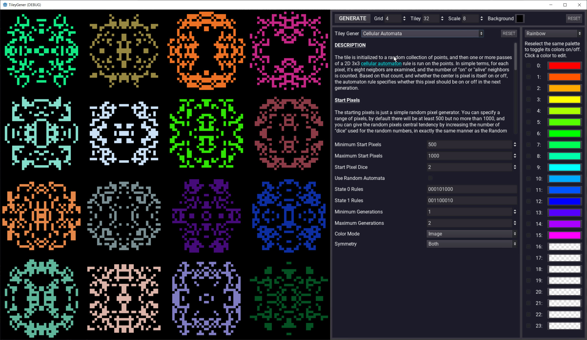

The app is divided into four panels:

- The leftmost panel displays the generated tiles
- The top right panel controls the size and number of tiles displayed
- The far right panel allows for selecting palettes and colors for tiles
- The central panel is a property inspector for the current tile generator

Generated tile images can be saved by clicking on them. A file save dialog will popup with a default option to save the image to the "res://save" folder with a timestamp for a default filename.

## Included Generators
The included generators each contain fairly detailed information about how they work and their options in the app itself, but here is an overview of each generator and samples of generated images.
### Random Pixels
Literally, it generates tiles with random pixels. It has some options that allow for the generation of multiple layers (passes) of random pixels, and the ability to change the random distribution by "rolling dice" instead of just using RNG across the range of pixels. It also has some options for symmetry, and various options for assigning colors to layers or pixels.

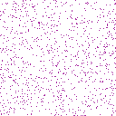 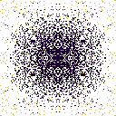 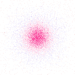
### Fixed Set Attractors
Images are generated by first creating a set of fixed points, each with an attraction strength. One of the fixed points is chosen at random as the starting pixel. The next pixel is generated by choosing any one of the other fixed points at random, and moving toward it by the distance specified by the new point's attraction value. For example, if the attraction value is 0.5, the new pixel will be exactly halfway between the current position and the new pixel. This process is repeated until the desired number of pixels has been generated.

*The default setup can result in a special case: three fixed points uniformly distributed along the edge of a circle, with each point having an attraction of 0.5. The result is a fractal known as the [Sierpiński triangle](https://en.wikipedia.org/wiki/Sierpi%C5%84ski_triangle).*

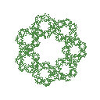 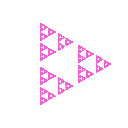 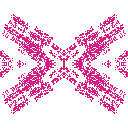
### Cellular Automata
The tile is initialized to a random collection of points, and then one or more passes of a 2D 3x3 [cellular automaton](https://en.wikipedia.org/wiki/Cellular_automaton) rule is run on the points. In simple terms, for each pixel, it's eight neighbors are examined, and the number of "on" or "alive" neighbors is counted. Based on that count, and whether the center is pixel is itself on or off, the automaton rule specifies whether this pixel should be on or off in the next generation.

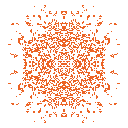 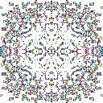 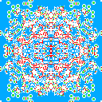
### Diamond-Square Terrain Algorithm
The [Diamond-Square Algorithm](https://en.wikipedia.org/wiki/Diamond-square_algorithm) is a fractal heightmap algorithm. The algorithm has a tendency to create artifacts along major rows and diagonals, and there are better noise-based terrain generators now in existence, but the diamond-square algorithm is easy to implement and produces some very nice results for the minimal effort.

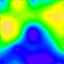 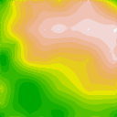 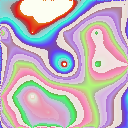
### Spirograph
A Spirograph, if you've never seen one, is perhaps best explained by the result of a [Google image search for the word "spirograph"](https://www.google.com/search?q=spirograph&tbm=isch). Technically, a Spirograph drawing is a curve formed by rotating a moving circular disc against the inner or outer edge of a fixed circluar disc, with a pen fixed at some distance from the center of the moving circle.  [This page](http://www.mathematische-basteleien.de/spirographs.htm) contains an excellent explanation of the actual mathematics, and this implementation is based on the formulas presented on that page. (Note: Spirographs generated using moving or fixed discs that have shapes other than circular are possible, but this implementation considers only circular discs.)

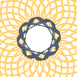 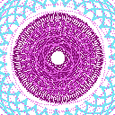 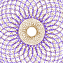
## Adding New Generators
The best way to learn to add a new generator is to watch [this video](https://youtu.be/YLijwgcLor4) which shows step by step how to add a new generator, get properties for your generator into the inspector, work with colors, and add new palettes. The video is a walk-through of implementing a simple generator that produces some suprisingly complex and interesting images.

If you prefer to skip the video and just dive in, it's not difficult at all, studying the code of the included generators will get you going. Here's a quick overview of the steps involved in adding a new generator:

1. Add a new node of type Node under the node named Gener in the scene tree. (Note that the order in which the nodes appear in the list of Gener's children is the order they will appear in the OptionButton for selecting them.) Name your node something descriptive.
2. Add a script to your new node, and then copy the code from gener_template.gd (in the res:// folder) into your new script.
3. In the inspector, edit the Gener Name and Gener Description properties. The Gener Name is the text that will be displayed in the OptionButton for selecting your generator. The Gener Description is the text that describes how your generator works, the options, etc. The Gener Description supports bbcode.
4. In your new script, find the code for the generate_pixels() function.
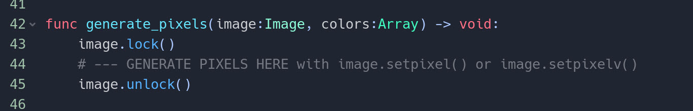
This is where you will add the code to generate pixels. The function receives an image and an array (possibly empty) of colors. The image is the image where you should generate the pixels, and the colors from the color palette if any colors are selected. If no colors are selected by the user, the colors array will be empty. It is up to your code to decide what to do with the color palette in any case. See the included generators for examples on ways to apply colors.
5. Your generator can specify the grid defaults it prefers by changing the values of the gener_grid_defaults dictionary near the top of the script.
6. If your generator has properties or options that you want the user to be able to manipulate at runtime, create variables for those properties and identify them to the inspector via the gener_properties dictionary.

## Author

[Ron Pacheco](mailto:ron@wolfden.pub)

## License

[MIT](https://github.com/wolfdenpublishing/tileygener/blob/master/LICENSE)
